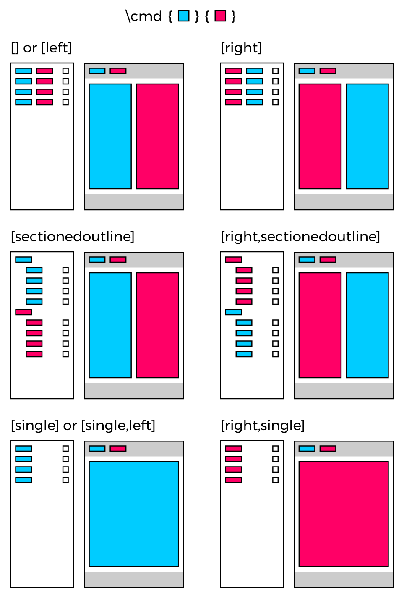

# Bilinguallegal

The `bilinguallegal` TeX package allow for the typesetting of bilingual legal
documents such as Terms and Conditions.

## Usage

The package accepts a few options that allow for different layouts.

 - `left` (default) or `right` indicates the main language. In a single-column
   layout this indicates the language displayed, while in a 2-column layout
   this indicates which language is displayed on the first i.e.: left column.
 - `sectionedoutline` activates an alternate layout for the tree displayed
   in the outline pane of the PDF reader in use. In a 2-column layout, this
   partitions the outline to provide separate root nodes for each language and
   therefore effectively displays two blocks with their respective trees.
   Without this option activated the outline is only a single tree with every
   node of that tree containing the section heads of both languages, provided
   that the 2-column layout is enabled.
 - `single` activate a single column layout, the outline of a single column
   document is not affected by the `sectionedoutline` option.

<div style="text-align: center;">
  
</div>

The commands of this package have been defined to accept left and right
arguments such that the left arguments accept the content for the default
language whilst the right arguments accept the content for the secondary
language.

The following snippet demonstrates how German and English content is passed to
the commands provided by this package.

```tex
\usepackage{latex/bilinguallegal/bilinguallegal}
\begin{document}
  \begin{legal}[0.5]
    \addtitle{Titel auf Deutsch}{Title in English}
    
    \insertTOCs{Inhaltsverzeichnis}{Table of Contents}
    
    \newpage
    
    \addsection{GeneralProvisions}{Allgemeine Bestimmungen}{General Provisions}
    
    \addclause{SubjectMatter}{Gegenstand und Ziele}{Subject Matter}{
      \begin{enumerate}[(1)]
        \item Diese Verordnung enthält Vorschriften zum Schutz natürlicher
        Personen bei der Verarbeitung personenbezogener Daten und zum freien
        Verkehr solcher Daten.
        \item Diese Verordnung schützt die Grundrechte und Grundfreiheiten
        natürlicher Personen und insbesondere deren Recht auf Schutz
        personenbezogener Daten.
        \item Der freie Verkehr personenbezogener Daten in der Union darf aus
        Gründen des Schutzes natürlicher Personen bei der Verarbeitung
        personenbezogener Daten weder eingeschränkt noch verboten werden.
      \end{enumerate}
    }{
      \begin{enumerate}[(1)]
        \item This Regulation lays down rules relating to the protection of
        natural persons with regard to the processing of personal data and
        rules relating to the free movement of personal data.
        \item This Regulation protects fundamental rights and freedoms of
        natural persons and in particular their right to the protection of
        personal data.
        \item The free movement of personal data within the Union shall be
        neither restricted nor prohibited for reasons connected with the
        protection of natural persons with regard to the processing of personal
        data.
      \end{enumerate}
    }
  \end{legal}
\end{document}
```

Note that in some cases commands may take more than just two arguments for the
different languages as in:

 - `\addsection{labelName}{leftTitle}{rightTitle}` where `labelName` is
   the label one may use in the text by means of the `ref{labelName}`
   command to refer to this section.
 - `\addclause{labelName}{leftTitle}{rightTitle}{leftBody}{rightBody}`
   where separate pairs of arguments allow the specification of title and body
   text for the two languages.

## Examples

Look at [examples/gdpr.tex](examples/gdpr.tex) for an example on the usage of
the `bilingualagreement` package.
